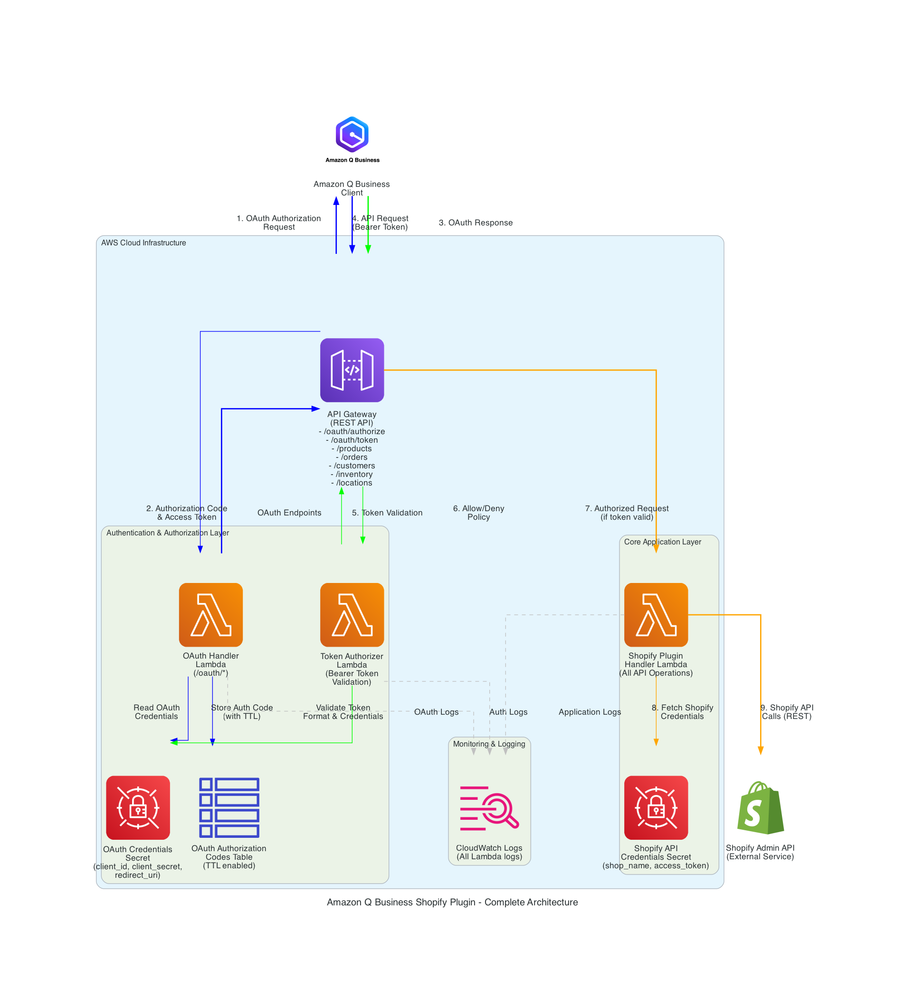

# Amazon Q Business Shopify Integration Plugin

## 🚀 Overview

This project provides a production-ready custom plugin that integrates **Amazon Q Business** with the **Shopify Admin API**, enabling natural language interactions with your Shopify store. Users can ask conversational questions about products, orders, customers, and inventory, receiving accurate responses based on real-time data from your Shopify store.

The plugin transforms natural language queries into structured API calls to Shopify, allowing business users to access e-commerce data without needing to learn the Shopify admin interface or API structure.

## ✨ Key Benefits

- **🗣️ Natural Language Commerce Management**: Interact with your Shopify store using conversational language
- **📊 Simplified Data Access**: Retrieve complex e-commerce data through simple questions
- **⚡ Streamlined Operations**: Perform common tasks like inventory updates without navigating the Shopify admin
- **🔗 Integrated Business Intelligence**: Combine Shopify data with other business systems through Amazon Q Business
- **👥 Reduced Training Needs**: Enable team members to access Shopify data without extensive platform training
- **🔒 Enterprise Security**: OAuth 2.0 authentication with AWS-managed credentials
- **☁️ Serverless Architecture**: Auto-scaling, cost-effective AWS infrastructure

## 🎯 Use Cases

### Sales and Inventory Management
- *"Show me products with low inventory"*
- *"Update stock for our bestsellers"*
- *"Which products haven't sold this month?"*

### Order Processing
- *"List all unfulfilled orders from last week"*
- *"Show me details for order #1234"*
- *"What's our total sales this month?"*

### Customer Insights
- *"Who are our top 5 customers by spend?"*
- *"Show me customer details for john@example.com"*
- *"How many repeat customers do we have?"*

### Product Management
- *"Create a new t-shirt product priced at $24.99"*
- *"Update the description for our winter collection"*
- *"Show me all products by vendor ABC Company"*

## 🏗️ Technical Architecture

This plugin implements a modern **serverless microservices architecture** on AWS:

### Core Components
- **🏗️ AWS CDK**: Infrastructure as code for deploying all required resources
- **⚡ AWS Lambda**: Three separate functions (OAuth handler, token authorizer, main handler)
- **🌐 Amazon API Gateway**: RESTful API with OAuth 2.0 endpoints
- **🗄️ Amazon DynamoDB**: OAuth authorization code storage with TTL
- **🔐 AWS Secrets Manager**: Secure credential storage for OAuth and Shopify credentials
- **📋 CloudWatch Logs**: Centralized logging and monitoring
- **📝 OpenAPI Schema**: Complete specification optimized for Amazon Q Business



### Architecture Flow

1. **Authentication Flow**: Amazon Q Business performs OAuth 2.0 authorization code flow
2. **Request Processing**: API Gateway validates Bearer tokens using custom authorizer
3. **Shopify Integration**: Main Lambda function processes requests and calls Shopify API
4. **Response Handling**: Structured data is returned to Amazon Q Business for natural language presentation

### Security Features

- 🔐 **OAuth 2.0 Authorization Code Flow** with PKCE support
- 🛡️ **Custom Lambda Authorizer** for token validation
- 🔒 **AWS Secrets Manager** for credential management
- 🔑 **DynamoDB TTL** for automatic auth code cleanup
- 📊 **CloudWatch Logging** for security monitoring

## Project Structure

```
sample-amazonq-biz-shopify/
├── README.md                    # This file
├── cdk-shopify/                 # CDK infrastructure code
│   ├── bin/                     # CDK app entry point
│   ├── lib/                     # CDK stack definitions
│   ├── src/                     # Source code
│   │   ├── lambda/              # Lambda function code
│   │   └── openapi/             # OpenAPI schema
│   ├── scripts/                 # Utility scripts
│   ├── tests/                   # Test files
│   ├── docs/                    # Additional documentation
│   ├── assets/                  # Images and assets
│   └── README.md                # CDK-specific documentation
└── .gitignore                   # Git ignore rules
```

## Quick Start

### Prerequisites

- AWS account with appropriate permissions
- Node.js 18.x or later
- AWS CDK installed globally (`npm install -g aws-cdk`)
- Shopify store with Admin API access
- Amazon Q Business administrator access

### Step 1: Create Shopify API Credentials

1. Log in to your Shopify admin panel
2. Navigate to Apps > Develop apps
3. Create a new private app with the following permissions:
   - Products: Read/Write
   - Orders: Read
   - Customers: Read
   - Inventory: Read/Write
4. Note your API key, API password, and shop name

### Step 2: Deploy the Plugin Infrastructure

```bash
# Clone the repository
git clone <repository-url>
cd sample-amazonq-biz-shopify/cdk-shopify

# Install dependencies
npm install

# Configure Shopify credentials
cp shopify-credentials.example.json shopify-credentials.json
# Edit shopify-credentials.json with your actual credentials

# Build the TypeScript code
npm run build

# Deploy the CDK stack
npx cdk deploy
```

Note the outputs from the CDK deployment, which include:
- API Gateway URL (will be used as the plugin endpoint)
- Lambda function ARN
- Authentication secret ARN

### Step 3: Configure Amazon Q Business Plugin

1. Access your Amazon Q Business admin console
2. Navigate to the Plugins section
3. Create a new custom plugin
4. Upload the OpenAPI schema from `cdk-shopify/src/openapi/shopify-schema.yaml`
5. Configure the base URL to point to your API Gateway URL (from CDK outputs)
6. Set up authentication using the credentials from AWS Secrets Manager:
   ```bash
   # Retrieve OAuth credentials from AWS Secrets Manager
   aws secretsmanager get-secret-value --secret-id "QBusiness-shopify-plugin/auth" --query SecretString --output text | jq '.'
   ```
7. Test and activate the plugin

## Authentication

The plugin uses OAuth2-compatible authentication stored in AWS Secrets Manager. The secret contains:
- `client_id`: Plugin identifier
- `client_secret`: Auto-generated secure password
- `redirect_uri`: OAuth callback URL

Retrieve your authentication credentials after deployment:

```bash
# Get OAuth credentials for Amazon Q Business configuration
aws secretsmanager get-secret-value --secret-id "QBusiness-shopify-plugin/auth" --query SecretString --output text | jq '.'
```

## Testing

You can test your deployed API by:

1. **Using the AWS Console**: Test Lambda functions directly through the AWS Console
2. **CloudWatch Logs**: Monitor function execution and debug issues
3. **Amazon Q Business**: Test plugin operations directly in the Q Business interface
4. **Manual API Testing**: Use tools like curl or Postman to test API endpoints directly

## Example Queries

Once the plugin is configured, users can ask questions like:

### Product Management
- "Show me our top 5 selling products"
- "How many t-shirts do we have in stock?"
- "Create a new product called 'Summer Dress' with a price of $49.99"
- "Update the description for product ID 12345"

### Order Management
- "Show me all orders from the last week"
- "How many unfulfilled orders do we have?"
- "Get details for order #1001"
- "What's our total sales for this month?"

### Customer Management
- "Who are our top customers by order value?"
- "Show me customer information for john.doe@example.com"
- "How many customers have made more than 3 purchases?"

### Inventory Management
- "Which products are low on inventory?"
- "Update the stock level for product 'Blue T-shirt' to 50 units"
- "Show me inventory levels across all locations"

## Security Considerations

This implementation includes several security best practices:

- **Credential Management**: Shopify API credentials are stored in AWS Secrets Manager
- **⚠️ Manual Credential Rotation**: Shopify access tokens MUST be rotated manually (see Security & Maintenance section)
- **API Authentication**: All endpoints require OAuth2-compatible authentication
- **Least Privilege**: Lambda functions have only the permissions they need
- **Input Validation**: All inputs are validated before processing
- **Secure Communication**: HTTPS-only communication

## Customization

### Adding New Operations

To add new operations to the plugin:

1. Update the OpenAPI schema in `cdk-shopify/src/openapi/shopify-schema.yaml`
2. Implement the corresponding handler in `cdk-shopify/src/lambda/shopify-plugin-handler.ts`
3. Add any necessary API Gateway resources in `cdk-shopify/lib/cdk-shopify-stack.ts`
4. Rebuild and redeploy: `npm run build && npx cdk deploy`
5. Update the plugin configuration in Amazon Q Business

### Extending Data Models

To extend the data models:

1. Add new schemas to the OpenAPI schema
2. Update the Lambda function to handle the new data structures
3. Ensure proper transformation between Shopify API responses and your schema

## Troubleshooting

### Common Issues

1. **Lambda Function Errors**:
   - Check CloudWatch Logs for detailed error messages
   - Verify Shopify credentials are correct in Secrets Manager
   - Ensure the Lambda has permission to access the secret

2. **API Gateway Issues**:
   - Test endpoints directly using tools like curl or Postman
   - Check API Gateway CloudWatch Logs
   - Verify OAuth flow is working through Amazon Q Business

3. **Amazon Q Business Integration Problems**:
   - Validate the OpenAPI schema using a validator tool
   - Ensure the base URL is correctly configured
   - Check that all required operations are implemented

### Getting Help

- Check the [CDK documentation](cdk-shopify/README.md) for infrastructure-specific issues
- Review CloudWatch Logs for runtime errors
- Test individual endpoints manually to isolate issues

## Contributing

1. Fork the repository
2. Create a feature branch
3. Make your changes
4. Add tests for new functionality
5. Submit a pull request

## License

This project is licensed under the MIT License - see the LICENSE file for details.

## 🔒 Security & Maintenance

### ⚠️ Critical: Manual Shopify Credential Rotation

**IMPORTANT**: Shopify access tokens cannot be automatically rotated and MUST be manually updated by administrators as a critical security requirement.

#### When to Rotate Credentials

- **Quarterly**: Regular security maintenance schedule
- **Immediately**: If credentials may be compromised
- **Before departures**: When team members with access leave
- **After incidents**: Part of security incident response

#### How to Rotate Shopify Credentials

**⚠️ Important**: Follow the official Shopify client credential rotation process to avoid downtime. For complete details, see the official documentation: [Shopify Client Credential Rotation Guide](https://shopify.dev/docs/apps/build/authentication-authorization/client-secrets/rotate-revoke-client-credentials)

The following is a summary of the official 6-step rotation process:

1. **Create a new client secret** in Partner Dashboard
2. **Configure webhooks** to accept both old and new secrets temporarily
3. **Configure OAuth** to use the new client secret
4. **Generate a new refresh token** from Partner Dashboard
5. **Request new access tokens** using the refresh token
6. **Revoke the old client secret** once all tokens are updated

**For this AWS integration specifically**:

1. **Generate new credentials in Shopify**:
   - Log in to Shopify admin → Settings → Apps and sales channels
   - Find "Amazon Q Business Integration" app → App settings
   - Follow the [official rotation process](https://shopify.dev/docs/apps/build/authentication-authorization/client-secrets/rotate-revoke-client-credentials)
   - **Copy new token immediately** (shown only once)

2. **Update AWS Secrets Manager**:
   ```bash
   aws secretsmanager update-secret \
     --secret-id "shopify/credential" \
     --secret-string '{"SHOPIFY_SHOP_NAME":"your-shop.myshopify.com","SHOPIFY_ACCESS_TOKEN":"your-new-token"}'
   ```

3. **Test the integration**:
   - Test the plugin through Amazon Q Business to verify it's working
   - Check CloudWatch Logs for any authentication errors
   - Verify API responses are successful

**📖 Full Documentation**: Always refer to the [official Shopify documentation](https://shopify.dev/docs/apps/build/authentication-authorization/client-secrets/rotate-revoke-client-credentials) for the complete rotation procedure to ensure zero-downtime rotation.

#### Set Up Rotation Reminders

```bash
# Create quarterly reminder
aws events put-rule \
  --name "shopify-credential-rotation-reminder" \
  --schedule-expression "rate(90 days)" \
  --description "Reminder to rotate Shopify credentials"
```

### Monitoring & Health Checks

Monitor your plugin using:

- **CloudWatch Logs**: Lambda function execution logs
- **CloudWatch Metrics**: API Gateway and Lambda performance metrics
- **Cost Monitoring**: Track usage and optimize costs

### Maintenance Schedule

- **Monthly**: Review metrics, verify functionality, check for AWS updates
- **Quarterly**: **🔑 ROTATE SHOPIFY CREDENTIALS** (Critical manual task)
- **Annually**: Security audit, architecture review, dependency updates

## Changelog

### Version 1.1.0
- Added OAuth2-compatible authentication for Amazon Q Business
- Improved project structure and organization
- Enhanced security with proper credential management
- Added automatic secret rotation for OAuth credentials

### Version 1.0.0
- Initial release with basic Shopify integration
- Support for products, orders, customers, and inventory operations
- Basic authentication and API Gateway setup
